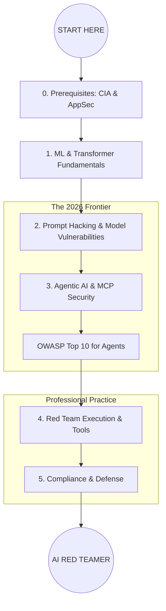

# 🛡️ AI/LLM Red Teaming Roadmap (2026 Edition)

This repository is a structured, community-driven roadmap for transitioning from traditional AppSec to **AI/LLM Red Teaming**. It integrates the latest 2026 industry standards, including **Agentic Security** and the **Model Context Protocol (MCP)**.

## 🗺️ Visual Learning Path

---

## ⚖️ Safety vs. Security: Understanding the Scope

A professional AI Red Teamer must distinguish between these two pillars:

* **AI Safety (Harmful Content):** Preventing the model from generating toxic, biased, or illegal content (e.g., "How do I build a bomb?").
* **AI Security (Exploitation):** Preventing the model/system from being compromised as a technical asset (e.g., "Remote Code Execution via Prompt Injection").

---

## 🛑 Step 0: Prerequisites

Before diving into AI, you must have a solid grasp of the **CIA Triad** (Confidentiality, Integrity, Availability) in traditional systems.

* **Confidentiality:** Can a prompt extract PII or training data?
* **Integrity:** Can an attacker "poison" the model's logic?
* **Availability:** Can an adversary trigger a "Denial of Service" via resource-heavy recursive prompts?

---

## 🚀 The Path to Mastery

### 🟦 Level 1: Foundational Knowledge

*Before you can break it, you must understand how it's built.*

* [ ] **AI/ML Fundamentals**
* [ ] [Learn Prompting (Fundamental Course)](https://learnprompting.org)
* [ ] Supervised vs. Unsupervised vs. Reinforcement Learning (RLHF)
* [ ] Neural Networks & Transformer Architectures (BERT, GPT, Attention)
* [ ] Retrieval-Augmented Generation (RAG) Architectures

### 🟨 Level 2: Prompt Hacking & Model Vulnerabilities

*The core of LLM-specific exploitation.*

* [ ] **Prompt Hacking Techniques**
* [ ] **Direct Prompt Injection:** Overriding system instructions.
* [ ] **Indirect Prompt Injection:** Attacking via RAG or web search results.
* [ ] **Jailbreaking:** Persona adoption, encoding bypasses, and safety filter evasion.

* [ ] **Model-Level Attacks**
* [ ] **Data Poisoning:** Manipulating training/fine-tuning datasets.
* [ ] **Model Extraction:** Stealing weights or logic via API queries.
* [ ] **Privacy Attacks:** Model Inversion & Membership Inference.

### 🟧 Level 3: Agentic AI & Infrastructure (2026 Core)

*In 2026, AI is no longer just a chatbot; it's an Agent with tools.*

* [ ] **The Agentic Security Interface (ASI)**
* [ ] [OWASP Top 10 for Agents](https://owasp.org/www-project-top-10-for-large-language-model-applications/)
* [ ] **Goal Hijacking:** Redirecting an agent's autonomous mission.
* [ ] **Tool Misuse:** Escalating privileges through authorized API tools.

* [ ] **Model Context Protocol (MCP) Security**
* [ ] Securely connecting agents to local/remote data sources.
* [ ] Vulnerability assessment of MCP servers.

* [ ] **System Infrastructure**
* [ ] **Insecure Deserialization** in model pickles.
* [ ] **Remote Code Execution (RCE)** via sandboxed code interpreters.

### 🟥 Level 4: Practical Experience & Methodology

*Hands-on application and professional standards.*

* [ ] **Testing Methodologies**
* [ ] Black Box, White Box, and Grey Box testing for AI.
* [ ] Automated vs. Manual Red Teaming.

* [ ] **The Toolbelt**
* [ ] [PyRIT (Python Risk Identification Toolkit)](https://www.google.com/search?q=https://github.com/Azure/pyrit)
* [ ] [Garak: The LLM Vulnerability Scanner](https://github.com/leondz/garak)

* [ ] **Hands-on Labs**
* [ ] [HackAPrompt CTF](https://www.hackaprompt.com/)
* [ ] [TensorTrust (Interactive Lab)](https://tensortrust.ai)

### 🟩 Level 5: Professional Development & Defense

*Hardening systems and staying ahead of the curve.*

* [ ] **Defense Strategies**
* [ ] Adversarial Training & Input/Output Guardrails (LlamaGuard).
* [ ] Continuous Monitoring & Anomaly Detection for Agents.

* [ ] **Industry Standards**
* [ ] [MITRE ATLAS Framework](https://atlas.mitre.org)
* [ ] **EU AI Act & NIST AI RMF:** Regulatory compliance for red teaming.

* [ ] **Community & Credentials**
* [ ] **Conferences:** DEF CON AI Village.
* [ ] **Courses:** SANS AI Security tracks.

---

## 🛠️ Contribution

This roadmap is always evolving. If you find a new vulnerability class or a better tool, please open a PR!
